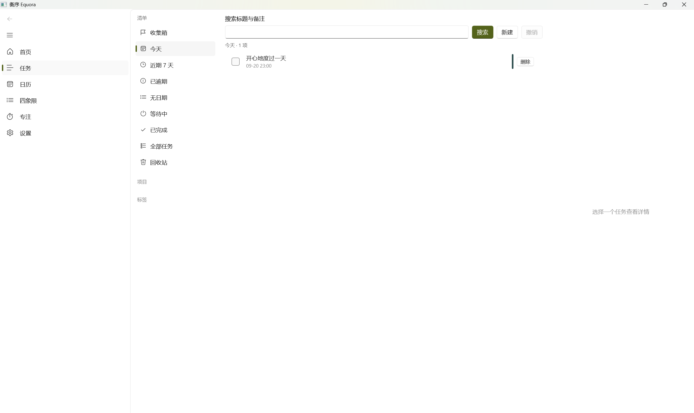
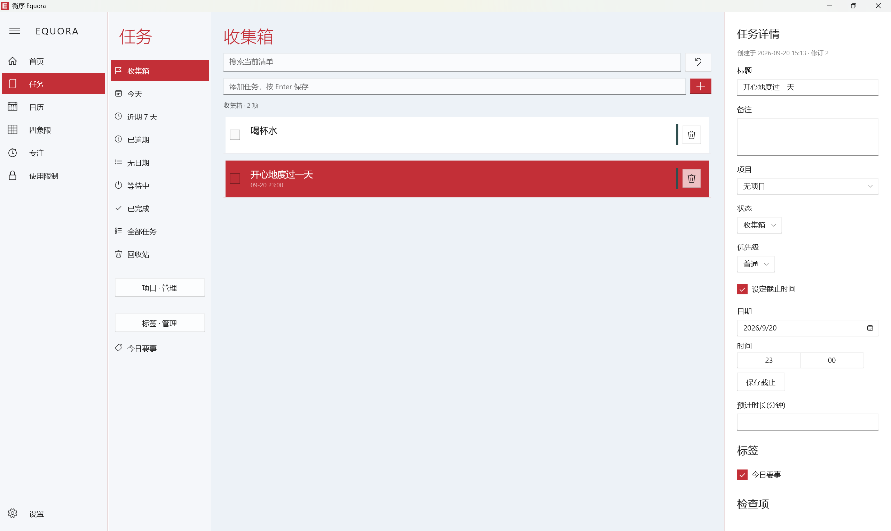

# Equora 衡序 — 发布说明

## v1.1.0（2026-09-23）— 桌面小组件与日历体验

新增 Windows 7 桌面小工具式的小组件(钉在桌面层、可拖动、不占任务栏)：任务小组件显示未完成任务并支持打勾完成，日历小组件支持日/周/议程三视图。日历页“时间段”统一改称“日程”；新建日程与设置的主题色输入框新增实时色号预览方块并支持点击弹出选色表；批量编辑/删除改用复选框选中。详见 [v1.1.0 更新说明](v1.1.0.md)。

## v1.0.3（2026-09-23）— 稳定性与自保护

移除"受限窗口最小化后从任务栏隐藏"(会导致进程无法正常关闭)；新增 Equora 相关进程自保护回归测试——规则校验与求值双重拦截,手动改配置也无法限制 Equora 自身、扩展宿主与同步服务器。详见 [v1.0.3 更新说明](v1.0.3.md)。

## v1.0.2（2026-09-23）— 日历与使用限制更新

ICS 导入的日程现可右键编辑和删除，重复日程提供整组操作。受限进程显示与扩展一致的封锁页（完整露出标题栏、持续覆盖不随焦点消失、最小化即从任务栏隐藏、纯色红色关闭与白色临时允许按钮）及每个应用一次的 5 分钟临时允许；分心提醒钉在应用窗口顶部正中并逐帧跟随；有每日额度的网站与进程在窗口右上角持续显示剩余时间，不依赖前台焦点，10 分钟内按秒倒计时。详见 [v1.0.2 更新说明](v1.0.2.md)。

## v1.0.1（2026-09-23）— 正式版修复

修复中文等非 ASCII 路径下 ICS 导入失败（`cannot read ics file`）的问题；同类修复覆盖 ICS 导出、任务 JSON/CSV 导入导出、备份与日志及数据库路径。详见 [v1.0.1 更新说明](v1.0.1.md)。

## v1.0.0（2026-09-23）— 正式版

学期批量添加支持选择是否创建任务；时间段支持独立标题与右键批量编辑/删除，可同时处理关联任务。新增学期结束自动归档、以往学期查看，以及三次确认的本机数据重置。官网和帮助中心同步更新。详见 [v1.0.0 正式版说明](v1.0.0.md)。

## v0.2.2 — 学期模式

新增学期名与起止日期设置、学期周次显示、按每周或指定周次批量添加独立任务和时间段。关闭模式需要二次确认，已添加内容保持不变。详见 [v0.2.2 更新说明](v0.2.2.md)。

## v0.2.1 — 扩展修复与限制提示

修复网站临时允许的地址误判，补齐扩展面板与网页倒计时；新增全局暂停限制的黄色倒计时提示、回收站永久删除和删除二次确认。详见 [v0.2.1 更新说明](v0.2.1.md)。


## v0.2.0(2026-09-20)界面焕新与使用限制(预发布)

v0.2.0 是衡序迄今规模最大的一次更新。桌面应用的外观与交互按正式产品的标准全面重塑——品牌化导航外壳、工作概览首页、任务三栏工作台与全新主题系统,取代了 v0.1.x 的模板化界面;同时引入全新的「使用限制」模块,将专注管理从应用内延伸到应用程序与网站。安装形式同步升级,新增无需管理员权限的 EXE 安装包。

### 全新外观

<p align="center">
  
  
</p>
<p align="center"><em>工作概览:v0.1.x(左)与 v0.2.0(右)</em></p>

<p align="center">
  
  
</p>
<p align="center"><em>任务页:v0.1.x(左)与 v0.2.0(右)</em></p>

- **品牌化导航外壳**:「EQUORA」字标与紧凑图标栏取代默认导航模板;展开时内联推入而非遮挡当前页面,窄窗口自动折叠为图标栏。
- **工作概览首页**:v0.1.x 的工程自检页(运行自检/诊断输出)正式退役,代之以今日概览、待处理任务与「管理任务 / 查看日历 / 开始专注」快捷入口。
- **任务三栏工作台**:智能清单、任务列表与详情面板同屏;详情面板整合备注、项目、状态、优先级、截止时间、预计时长、标签与检查项。
- **全新主题系统**:浅色/深色/跟随系统;预设强调色与任意 `#RRGGBB` 自定义;高对比度跟随操作系统;外观偏好持久化于 preferences.json,解包构建同样生效。
- **交互细节一致性**:新建任务使用独立草稿字段;完成、删除、恢复与撤销保持选中与详情状态;搜索防抖;`Ctrl+Z` 撤销任务变更。

### 全新模块:使用限制

将「专注时该做什么」延伸为「专注时不做什么」。在新的「使用限制」页为应用程序与网站域名建立规则,设置一个或多个条件,任一满足即限制:

- **应用程序**:读取已安装应用或手动填写进程名;命中规则时窗口最小化,不结束进程、不丢失未保存内容;后台运行不计时。
- **网站(Edge/Chrome)**:MV3 扩展与本地消息组件;域名规则含子域名;按前台活动标签计时,不读取网页正文、不保存 URL 路径。
- **三类条件**:正在专注时禁止;每天指定时间段(支持跨午夜);每日可用分钟数(按本地日期重置,空闲 60 秒暂停统计)。
- **安全出口**:对单个域名临时允许 5 分钟;一键暂停所有限制 15 分钟;Windows 设置、任务管理器、文件管理器与衡序自身等关键进程永不被限制;桌面端退出或心跳超时自动解除。

详见 [使用限制指南](usage-restrictions.md)。

### 功能增强

- **任务分类**:项目与标签的创建、重命名、配色与删除;删除分类保留任务;详情面板直接分配。
- **专注暂停与继续**:暂停冻结计时,切换页面保持;恢复后续算有效专注时间;新增工作/休息轮次等会话模式。
- **托盘常驻与单实例**:关闭窗口最小化到托盘,专注进行中不中断;再次启动唤起既有实例;可恢复为常规退出。
- **日历**:时间块支持备注、颜色与时间编辑;删除时间块保留其中的任务。
- **数据目录迁移**:设置内迁移数据目录,快照式迁移与非覆盖保护。

### 安装格式

| 格式 | 适用 | 说明 |
|---|---|---|
| `Equora-vX.Y.Z-win-x64-Setup.exe` | 推荐 | 双击安装,用户级安装目录,免管理员、免证书信任,自带全部运行时 |
| `Equora-vX.Y.Z-win-x64.msix` | 侧载环境 | 需先信任同目录 `.cer`(`Cert:\LocalMachine\TrustedPeople`) |
| `Equora-vX.Y.Z-BrowserExtension.zip` | 网站限制 | 开发者模式加载,按应用内指引连接 |

两种桌面安装包均为自包含(无需 .NET 运行时),发布资产提供 `SHA256SUMS.txt` 校验。

### 测试覆盖

| 测试套件 | 数量 | 状态 |
|---|---|---|
| 原生核心(GoogleTest) | 137 | 全部通过 |
| 桌面应用(xUnit) | 127 | 全部通过 |
| 同步服务器(GoogleTest) | 20 | 全部通过 |
| 浏览器扩展与本地消息组件 | 3 | 全部通过 |
| **合计** | **287** | **全部通过** |

Release 产物在本机完成冒烟:解包 EXE 与安装后的 MSIX 均正常启动。

### 已知限制

- 安装包为自签名证书(CN=Equora),SmartScreen 可能提示;EXE 安装路径无需证书信任。
- 应用限制属自主使用管理:命中即最小化窗口,并非系统级防绕过锁定;后台音频与管理员程序不保证被阻止。
- 浏览器扩展未上架商店,需以开发者模式加载;网站限制要求桌面端保持运行。
- 同步服务器当前仅提供 HTTP,建议在本机或 Tailscale 等可信网络内使用。

### 从 v0.1.1 升级

- MSIX 直接覆盖安装;EXE 与 MSIX 为并行安装形态,可按需只保留其一。
- 数据库与偏好自动沿用,无需手动迁移。

---

## v0.1.1(2026-09-19)启动修复

- **修复启动即崩**:MainWindow 导航图标 `Icon="Bullets"`/`Icon="Timer"` 引用了 WinUI 3 `Symbol` 枚举不存在的成员名,XAML 运行期抛异常导致无窗口即退;改为 `FontIcon` 直接指定 Segoe Fluent 字形。该缺陷随 v0.1.0 发布,特此致歉。
- **安装格式调整**:自本版起以 MSIX 作为安装格式(自签名证书 CN=Equora,首次安装需将证书导入 `Cert:\LocalMachine\TrustedPeople`),已在本机实测安装与启动。
- v0.1.0 的发行资产已从 Release 页移除并加警示说明,请统一使用 v0.1.1 或更高版本。

## v0.1.0(2026-09-19)首个发布候选

### 核心能力

| 功能 | 状态 |
|---|---|
| 任务管理(三栏/智能清单/搜索/撤销) | 完整 |
| 日历(周视图/拖拽/冲突/重复/ICS) | 完整 |
| 四象限(拖拽/今日三要事/容量) | 完整 |
| 快速收集(自然语言解析/预览) | 完整 |
| 专注会话(5 种模式/分心捕获/崩溃恢复) | 完整 |
| 网站限制(MV3 扩展/白名单/临时允许) | 完整 |
| 智能规划(排程/拆分/估时校正) | 核心就绪 |
| 每日/每周复盘 | 完整 |
| 自动化规则 | 核心(界面待完善) |
| 多设备同步(服务器/协议/客户端) | 核心就绪 |
| 安全白名单/紧急解锁/审计 | 完整 |

### 测试覆盖

| 测试套件 | 数量 | 状态 |
|---|---|---|
| 原生核心(GoogleTest) | 137 | 全部通过 |
| 桌面应用(xUnit) | 105 | 全部通过 |
| 同步服务器(GoogleTest) | 20 | 全部通过 |
| **合计** | **262** | **全部通过** |

### 架构

```
WinUI 3(C#) ←C ABI v2→ C++20 核心 ←SQLite(WAL)→ 本地文件
                                      ↕ HTTPS(JSON)
                              Drogon + PostgreSQL(可选)
```

- 原生零警告编译(/W4)
- 6 个版本化数据库迁移(升级保留数据,失败回滚)
- 一致性备份(SHA-256 校验 + 恢复预演)
- 崩溃恢复(专注会话以最后活动时刻收尾)

### 性能基准(本机 SSD,Release 构建)

| 操作 | 耗时 | 目标 |
|---|---|---|
| 任务创建(1000 条) | P95 < 100ms | 达标 |
| 智能清单查询(1000 条) | < 50ms | 达标 |
| 全量列表(1000 条) | < 100ms | 达标 |
| 周窗口物化(500 块) | < 500ms | 达标 |
| 一致性备份(200 条) | < 2s | 达标 |

### 隐私

- 前台应用监测默认关闭;开启后仅读进程名(xxx.exe),不读窗口内容。
- 网络同步默认关闭;关闭状态零网络请求。
- 详见 [privacy-and-security.md](privacy-and-security.md)。

### 已知限制(历史记录,以当时版本为准)

| 项目 | 说明 |
|---|---|
| Windows Service 严格限制 | 基础就绪,Service 进程未构建 |
| Widgets / 通知操作按钮 | 需真机验证 |
| HTTPS 终端 | 同步服务器当前仅 HTTP(本机/Tailscale) |
| 自动排程 UI 预览 | 后端 API 完整,界面待打磨 |
| CalDAV / Outlook | 未实现 |

### 构建运行(源码)

```bash
# 构建原生
cd native && cmake --preset win-x64-release && cmake --build --preset win-x64-release

# 构建桌面
cd ../desktop && dotnet build Equora.slnx -c Release

# 运行(自动拷贝 DLL)
dotnet run --project Equora.App -c Release
```

### 同步服务器(Docker Compose)

```bash
docker compose -f docker/docker-compose.yml up --build
# 服务器: http://127.0.0.1:8787
# 令牌: dev-local-token(可自定义)
```

### 升级与卸载

- 数据库迁移自动执行(打开时检测版本并升级);建议升级前在设置页「立即备份」。
- 卸载:删除安装目录与 `%LOCALAPPDATA%\Equora\`(用户数据)。

---

### 许可

本项目采用 [MIT License](LICENSE)。

### 致谢

感谢所有第三方开源组件的贡献者 —— [完整清单](THIRD-PARTY-NOTICES.md)。
